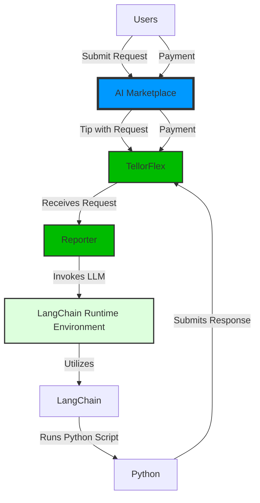

# AI Marketplace
AI Marketplace is a platform that allows users to share and sell their AI models. The platform is built with a payment system handled on chain. Service providers offer to host a LangChain Runtime Environment where a Python workload can be executed using LangChain. Use a model for a chat and pay per use. 

## Architecture


# Concepts
## Workload
A workload is a Python script that defines a LangChain model.

It MUST contain: 
- prompt - a string that is the prompt for the model
- input - a string that is the input for the model

It MAY contain:
- model - a string that is the model to use
- temperature - a float that is the temperature to use

Example: 
```
prompt = "What is the meaning of life?"
input = "The meaning of life is to be happy."
```

These workloads are executed using a function that may look like this:
```python
function work(prompt: str, input: str) -> str:
    model = ChatOpenAI(openai_api_key=os.getenv("OPENAI_APY_KEY", ""), temperature=0.1)
    full_prompt = ChatPromptTemplate.from_messages(
        [
            ("system", prompt),
            ("human", "{input}"),
        ]
    )
    chain = (
        {"input": RunnablePassthrough()}
        | full_prompt
        | model
        | StrOutputParser()
    )

    return chain.invoke(input)
```
There's a lot more that can be put in as arguments for the `work` function but this is the minimum required. The example above assumes the workload executor has setup OpenAI and LangChain properly.

## Payments
Payments are made to a Host for the execution of a workload. The Host is responsible for executing the workload and returning the result. The payment is made using the LangChain token.

### Requesting Execution
Publish your prompt and input into a transaction onchain along with an amount of ETH to be paid to the host for running the workload. The host will execute the workload and return the result.

## Hosts
Hosts listen to a onchain index of workloads and execute them. They are paid for their services.

# Tellor Integration

# Future Work
* Better Model Execution Runtime Environment - The current runtime environment is very basic and could be improved.
* Homomophic Encryption - Encrypt the input and output of the workload so that the host cannot see the data. This would allow for more sensitive data to be used in the workloads.
* More Models - Add more models to the platform to allow for more diverse workloads.
* More Payment Options - Add more payment options to the platform to allow for more diverse payment options.
